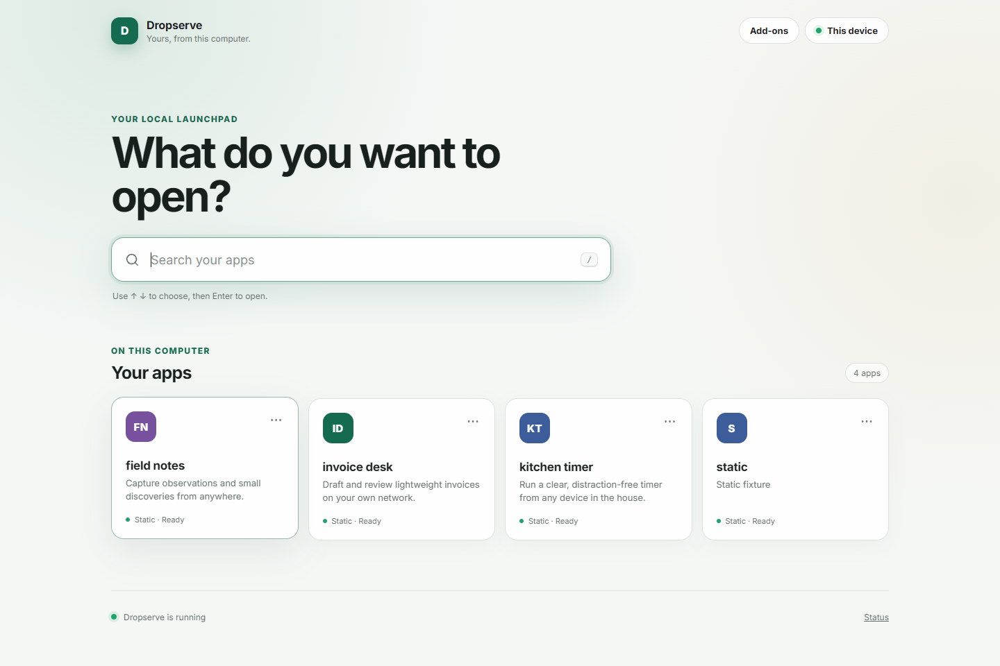
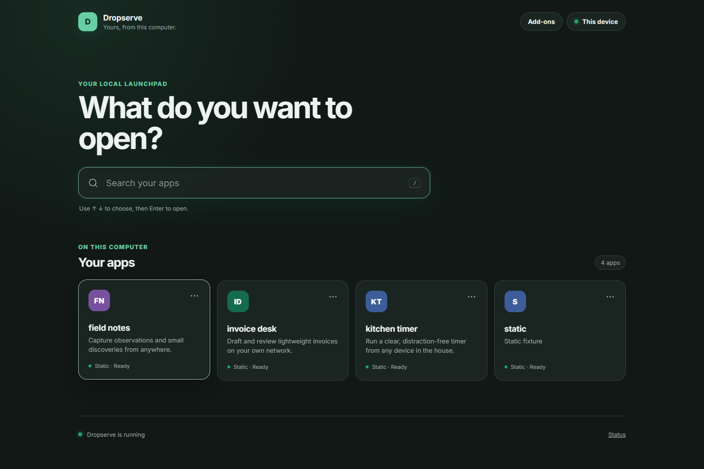

# Dropserve

[](https://github.com/tanzir71/dropserve/actions/workflows/ci.yml)
[](LICENSE)

Dropserve turns folders on one computer into local websites. Put an app in your Apps folder and it appears on a searchable dashboard without configuration or a restart. Static sites work immediately; Node, Python, PHP, SQLite, MariaDB, and PostgreSQL are supported without bundling a heavyweight stack into the base install.

| Light | Dark |
|---|---|
|  |  |

## What it does

- Discovers app folders and serves them at stable, readable URLs.
- Updates the dashboard within two seconds when folders change.
- Serves static sites and supervises Node or Python command apps.
- Handles subpath-hostile apps with stable dedicated ports and clear rescue links.
- Offers optional, verified PHP, MariaDB, and PostgreSQL packs; the base install contains none of them.
- Browses app-local SQLite databases read-only.
- Shares verified loopback, LAN, mDNS, and Tailscale addresses with local QR codes.
- Keeps public Tailscale Funnel sharing off until one app is explicitly confirmed.
- Offers opt-in local HTTPS and never changes the operating-system trust store without an explicit action.
- Starts at login, lives in the Windows tray, and includes a complete `doctor` report.

## Try the current build

The first tagged installer is still being acceptance-tested. Until it is published, build from source with Go 1.25 or newer and GNU Make:

```console
git clone https://github.com/tanzir71/dropserve.git
cd dropserve
make check
make build
```

On Windows, `make build` creates:

- `bin/dropserve.exe` — the console-free desktop and tray application.
- `bin/dropserve-cli.exe` — terminal commands and diagnostics.

Run `bin/dropserve.exe`. The one-screen setup asks for an Apps folder and whether Dropserve should start at login, creates a useful example app, and opens the dashboard. On Linux and macOS, run `bin/dropserve` for the same browser-based setup.

Useful commands:

```console
dropserve serve
dropserve add PATH
dropserve status
dropserve open
dropserve apps
dropserve logs SLUG -f
dropserve restart SLUG
dropserve doctor
dropserve autostart enable
dropserve trust install
dropserve firewall allow
dropserve tailscale status
dropserve runtime install php
dropserve config validate
```

`dropserve add PATH` registers a folder without moving, copying, or modifying it. Windows uses a current-user Scheduled Task, Linux uses a systemd user unit, and macOS uses a per-user LaunchAgent.

## Apps

A plain folder with `index.html` is enough:

```text
Apps/
└── kitchen-timer/
    ├── index.html
    ├── app.js
    └── app.css
```

Dropserve detects common static, Node, Python, and PHP layouts. An optional `dropserve.json` can set a display name, description, icon, command, environment, visibility, health path, SPA fallback, and other advanced behavior. App files remain yours: scanning, serving, and removal of optional runtimes do not write into them.

All manifest fields are optional. Unknown keys produce a dashboard warning, and malformed JSON falls back to normal detection instead of hiding the app. The reference shape is:

```json
{
  "name": "Invoice Maker",
  "description": "Makes PDF invoices",
  "icon": "📄",
  "tags": ["work", "pdf"],
  "type": "command",
  "command": "node server.js",
  "port_env": "PORT",
  "env": {"NODE_ENV": "production"},
  "health_path": "/",
  "autostart": true,
  "index": "index.html",
  "spa": false,
  "directory_listing": false,
  "base_href": "auto",
  "visibility": "lan",
  "pinned": false,
  "hidden": false
}
```

`config.toml` supports the documented `[server]`, `[dashboard]`, `[discovery]`, `[security]`, `[runtimes]`, and `[updates]` sections. `dropserve config edit` creates and opens it, `dropserve config validate` checks syntax and values, and safe settings are hot-reloaded. A malformed edit leaves the last good configuration running. Listener bind/port changes are reported and take effect after restart. Dropserve v1 accepts `runtimes.php_version = "8.3"` and currently pins the official PHP 8.3.33 Windows pack; per-app PHP versions remain out of scope.

The optional PIN lock expects the SHA-256 digest of a six-digit PIN. For example, PowerShell can generate it without sending the PIN anywhere:

```powershell
$pin = Read-Host 'Six-digit PIN'
$bytes = [Text.Encoding]::UTF8.GetBytes($pin)
$hash = [Convert]::ToHexString([Security.Cryptography.SHA256]::HashData($bytes)).ToLower()
```

Set `security.pin_enabled = true` and `security.pin_hash = "<hash>"`. Loopback access and the health check remain exempt so the owner cannot lock themselves out locally.

The dashboard's local JSON and SSE endpoints are documented in [docs/api.md](docs/api.md).

## Network and security model

Dropserve is a personal server for a home or office LAN, not a hardened public web server. By default, anyone on the same LAN can reach LAN-visible apps, and app processes run with your user account's privileges. Only add code you wrote or trust.

Per-app `visibility` is enforced before serving or proxying: `lan` (default), `local` (loopback only), `tailnet` (`100.64.0.0/10` sources only), or `public`. The optional PIN lock protects every non-loopback route except the health check. See [SECURITY.md](SECURITY.md) for the complete threat model and private reporting instructions.

Tailscale Serve is the preferred private remote-access path. Tailscale Funnel is the only public-internet path, is off by default, requires the exact app slug as confirmation, and expires automatically after eight hours. Local HTTPS is optional; installing its local certificate authority always requires a separate explicit action and can be fully undone.

The only routine outbound request made by the base application is a bounded, once-per-day check of this repository's latest GitHub release metadata. It never downloads or installs an update. Set this in `config.toml` to turn the check off:

```toml
[updates]
check = false
```

## Releases and Windows warnings

Release builds publish SHA-256 checksums, SPDX SBOMs, GitHub provenance attestations, and keyless Sigstore bundles. Windows binaries and the installer are also Authenticode-signed with the project's own certificate. That provides publisher identity and tamper evidence, but a self-signed certificate does not build Microsoft SmartScreen reputation, so a direct browser download may still show “Windows protected your PC.” The project documents that warning instead of promising a warning-free install.

After downloading an artifact and its matching `.sigstore.json` bundle, verify that it was signed by this repository's tag-only release workflow:

```bash
ARTIFACT=dropserve_1.2.3_windows_amd64.zip
cosign verify-blob \
  --bundle "$ARTIFACT.sigstore.json" \
  --certificate-identity-regexp '^https://github\.com/tanzir71/dropserve/\.github/workflows/release\.yml@refs/tags/v[0-9]+\.[0-9]+\.[0-9]+(-[0-9A-Za-z.-]+)?(\+[0-9A-Za-z.-]+)?$' \
  --certificate-oidc-issuer https://token.actions.githubusercontent.com \
  "$ARTIFACT"
```

The same artifact name appears in `checksums.txt`; compare its listed digest with `sha256sum "$ARTIFACT"` (or `Get-FileHash $ARTIFACT -Algorithm SHA256` on Windows).

The Windows installer asks for administrator approval once so it can add the private-network firewall rule required for other devices to connect. Dropserve itself runs as the signed-in user and its start-at-login task is current-user only. This elevation tradeoff is recorded in [ADR-014](docs/adr/014-windows-installer-elevation.md).

The Windows uninstaller stops Dropserve and removes its start-at-login task, firewall rule, and any Dropserve local certificate authority before deleting the install directory. Your own Apps folders are never removed.

## Development

`make check` is the merge gate. It runs formatting, static analysis, race-enabled tests, version injection, zero-CGO Windows/Linux/macOS builds, the optional Windows tray build, and a shipped-file scan. See [CONTRIBUTING.md](CONTRIBUTING.md) for the five product invariants every change must preserve and [DROPSERVE-HANDOVER.md](DROPSERVE-HANDOVER.md) for the authoritative build specification.

## Non-goals

- A production internet-facing web server.
- A Docker replacement, orchestrator, build system, or file-sync tool.
- A multi-user hosting service.
- A mandatory Apache/PHP/database bundle.

## Glossary

**App** — a folder in an Apps root. **Slug** — the URL-safe name derived from the folder name. **Apps root** — a folder Dropserve watches. **Mount** — making an app reachable at a URL. **Pack** — an optional downloadable PHP, MariaDB, or PostgreSQL runtime. **Own port** — the stable dedicated app port that remains available when path mounting is incompatible. **Tailnet** — your private Tailscale network. **Funnel** — Tailscale's public-internet exposure feature.

## Licence

Dropserve is available under the [MIT License](LICENSE).
